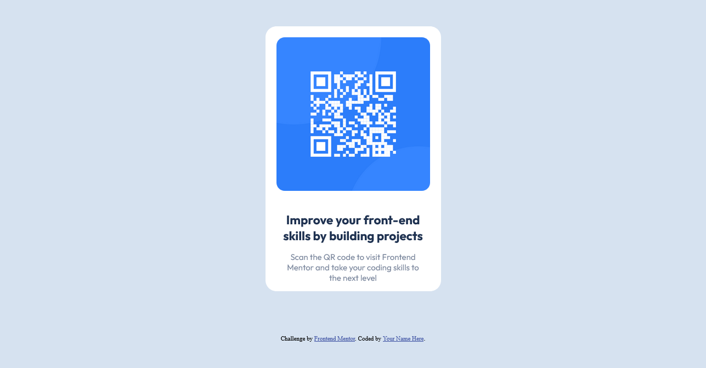

# Frontend Mentor - QR code component solution

This is a solution to the [QR code component challenge on Frontend Mentor](https://www.frontendmentor.io/challenges/qr-code-component-iux_sIO_H). Frontend Mentor challenges help you improve your coding skills by building realistic projects.

## Table of contents

- [Overview](#overview)
  - [Screenshot](#screenshot)
  - [Links](#links)
- [My process](#my-process)
  - [Built with](#built-with)
  - [What I learned](#what-i-learned)
  - [Continued development](#continued-development)
- [Author](#author)

**Note: Delete this note and update the table of contents based on what sections you keep.**

## Overview

Solving the challenge creating a component that show a qrcode and description adapt to mobile and desktop.

### Screenshot

### Links

- Solution URL: [https://github.com/csharls/frontend-mentor-go](https://github.com/csharls/frontend-mentor-go)
- Live Site URL: [Add live site URL here](https://your-live-site-url.com)

## My process

### Built with

- Semantic HTML5 markup
- CSS custom properties
- Flexbox
- CSS Grid
- Mobile-first workflow

### What I learned

I usue this challenge to refresh topics about css as flexbox and grid aswell as creating the layout.

### Continued development

I want to continue practicing the color palete creation and user friendly desings

## Author

- Website - [csharls](https://charlescode.wordpress.com/)
- Frontend Mentor - [@csharls](https://www.frontendmentor.io/profile/cshals)
- Twitter - [@csharls](https://www.twitter.com/csharls)
